<p align="center">
  
</p>

<p align="center">
  
</p>

<p align="center">
  <a href="https://www.tanmaxsharma.in">Portfolio</a> ·
  <a href="https://www.linkedin.com/in/tanmaxsharma">LinkedIn</a> ·
  <a href="https://github.com/tanmaxsharma">GitHub</a> ·
  <a href="mailto:tanmaysharma.eng05@gmail.com">Email</a>
</p>

---

### About

I'm a full-stack developer focused on building practical, production-grade software rather than side-project demos. I work primarily with React, Next.js, Node.js and TypeScript, and I'm equally comfortable across the stack — designing APIs, modeling databases, wiring up third-party integrations, and shipping to production.

I'm also interested in product and business — currently building at **Gradmarc Adtech LLP**, and independently exploring the intersection of engineering and product decisions.

### What I Build

- Full-stack web applications
- E-commerce platforms
- SaaS and business applications
- REST APIs and backend services
- Dashboards and management systems
- Third-party and payment integrations
- Production deployments and infrastructure

### Core Technologies

**Frontend**
React · Next.js · TypeScript · JavaScript

**Backend**
Node.js · Express.js · REST APIs · GraphQL

**Databases**
PostgreSQL · MongoDB · MySQL

**DevOps**
Docker · Nginx · GitHub Actions · AWS · Vercel

**Tools**
Git · GitHub · Postman · Jira · Figma

### Selected Projects

**Vibestore**
Production-oriented e-commerce platform focused on shopping experience, product discovery, filtering, and deployment.
`Next.js` · `React` · `WooCommerce` · `REST APIs` · `Docker`

**TubeScript**
Full-stack web application built with a separate frontend and backend architecture.
`React` · `Node.js` · `REST APIs`

**Video Conferencing**
Web-based application for real-time video communication.
`JavaScript` · `Web APIs`

**Project Management**
Application for managing projects and team workflows.
`JavaScript` · `CSS`

More on [github.com/tanmaxsharma](https://github.com/tanmaxsharma).

### Engineering Focus

```text
Frontend Architecture
        ↓
API & Backend Development
        ↓
Database Design
        ↓
Third-Party Integrations
        ↓
Deployment & Infrastructure
        ↓
Production Software
```

---

### Contribution Activity

<p align="center">
  
</p>

<p align="center">
<picture>
<source media="(prefers-color-scheme: dark)" srcset="https://raw.githubusercontent.com/tanmaxsharma/tanmaxsharma/output/github-snake-dark.svg" />
<source media="(prefers-color-scheme: light)" srcset="https://raw.githubusercontent.com/tanmaxsharma/tanmaxsharma/output/github-snake.svg" />

</picture>
</p>

### Currently Exploring

- Deeper infrastructure and deployment automation
- Scaling product-engineering practices as projects grow
- Applied AI in everyday product workflows

### Let's Connect

I'm open to interesting product and engineering work.

📧 [tanmaysharma.eng05@gmail.com](mailto:tanmaysharma.eng05@gmail.com) · 🔗 [LinkedIn](https://www.linkedin.com/in/tanmaxsharma) · 🌐 [tanmaxsharma.in](https://www.tanmaxsharma.in)
